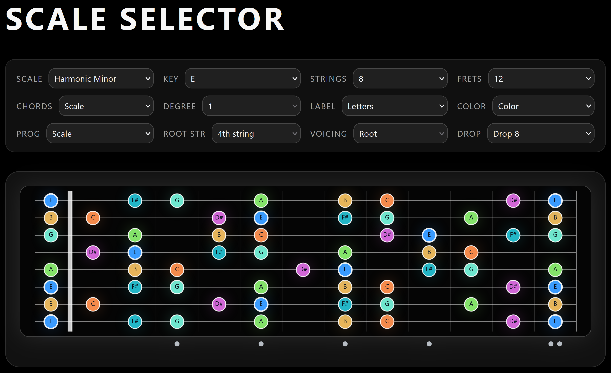
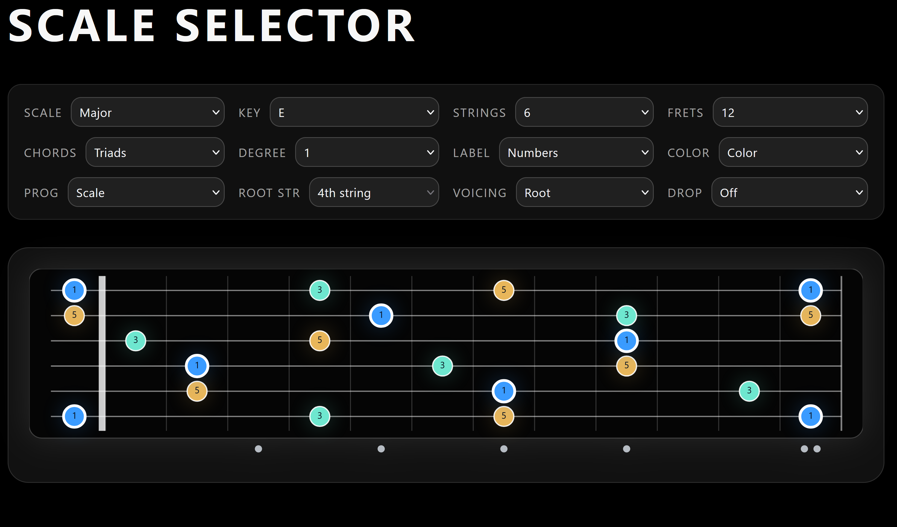
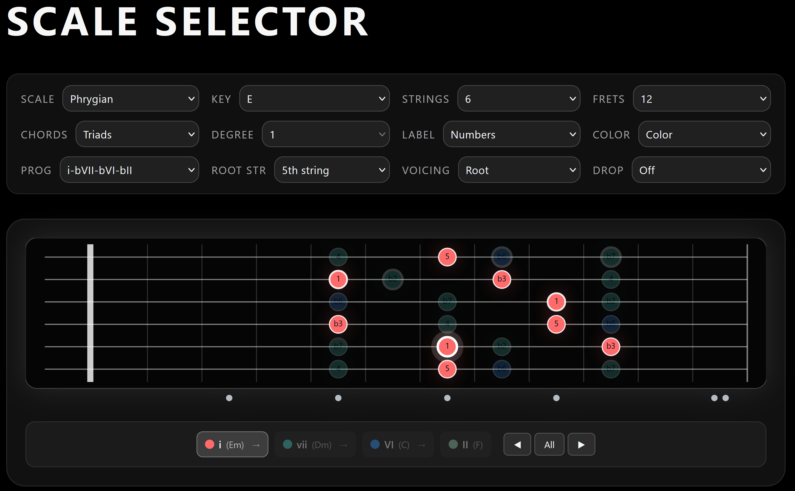
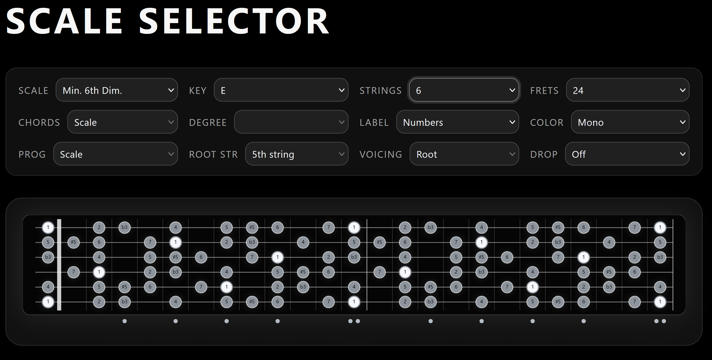

# Scale Selector

Created by **Travis A. Whetsell**.

Scale Selector is a guitar fretboard visualizer that displays all the notes of a selected musical scale as finger placement indicators on the fretboard.

Live demo: https://tawhetsell.github.io/scale-selector/

## What it does

Visualization options include:

1) Number of guitar strings (6 to 9)
2) Musical scale
3) Root note
4) Number of frets (12 or 24)
5) Chords view mode (scale tones, triads, or tetrads)
6) Chord degree selection (triad/tetrad views)
7) Finger placement labels (notes or intervals)
8) Finger placement color mode (interval-based color or monochromatic)
9) Chord progressions with CAGED/position-based display (I–IV–V, ii–V–I, etc.)
10) Root string selection (4th, 5th, or 6th) for CAGED position anchoring
11) Voicing/inversion selection (Root, 1st, 2nd, 3rd) for triads and tetrads
12) Drop tuning support for the lowest string

## Features

- Bass notes are highlighted with thick white outlines
- Key root anchor on the selected root string gets a halo effect in position mode
- Voicing works for both single chords and progressions
- Mono mode maintains neutral grayscale regardless of chord/voicing selections

## Screenshots

## Tech

- Vite + React
- Built through natural language prompting using `gpt-5-codex-high` and `claude-opus-4.5` in VS Code
- Deployed with GitHub Pages

## Run locally

    npm install
    npm run dev

Build for production:

    npm run build
    npm run preview

## License

MIT — see the [LICENSE](LICENSE) file.

Copyright (c) 2026 Travis A. Whetsell
